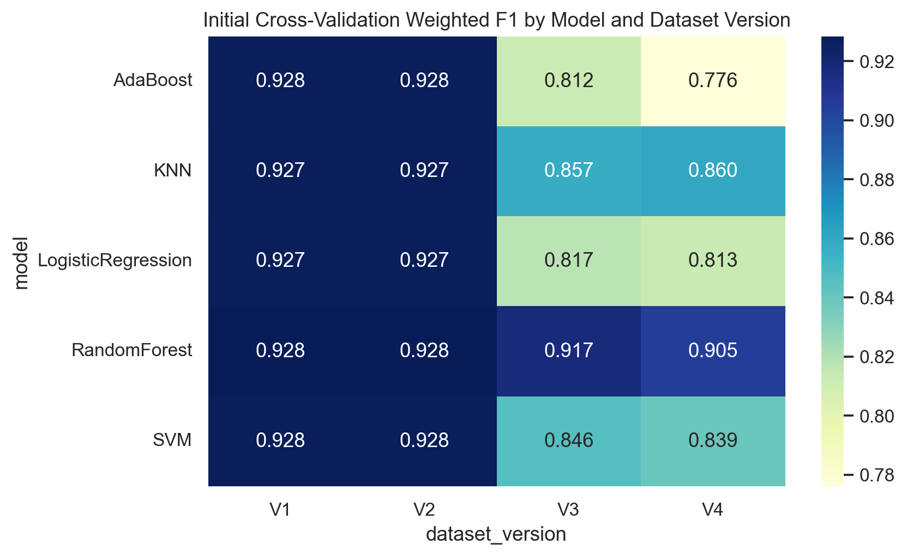
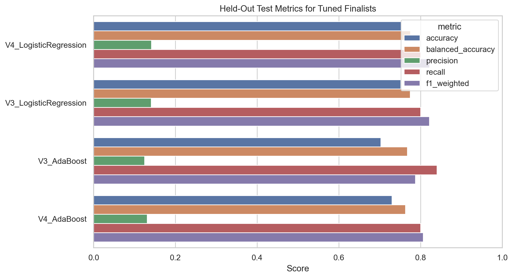

# Stroke Risk Prediction with Machine Learning

Machine Learning project focused on **stroke risk prediction** from clinical and lifestyle features.  
The repository documents the full workflow from dataset selection and exploratory analysis to preprocessing, model development, hyperparameter tuning, and final evaluation.

## Project Summary

This project uses the public **Stroke Prediction Dataset** from Kaggle to build and evaluate binary classification models that predict whether a patient is likely to have experienced a stroke.

The work emphasizes problems that matter in real ML practice:

- imbalanced classification
- missing-value handling
- categorical encoding
- leakage-aware preprocessing pipelines
- cross-validation and model comparison
- hyperparameter tuning with `GridSearchCV`
- report-ready outputs and visualizations

## Final Result

The best final pipeline was:

- **Dataset version:** `V4`
- **Model:** `LogisticRegression`
- **Balanced accuracy:** `0.775`
- **Recall:** `0.800`
- **Precision:** `0.141`
- **Weighted F1:** `0.822`

Why this matters:
accuracy-only evaluation on this dataset can be misleading because the stroke class is rare. Some high-accuracy models reached about `95%` accuracy while barely detecting any stroke cases. The final model was selected using **balanced accuracy and recall**, which is a much better fit for a medical screening use case.

## What This Repository Shows

- End-to-end ML project structure across multiple deliverables
- Exploratory data analysis with saved figures and summary tables
- Multiple preprocessing variants including scaling, SMOTE, and PCA
- Systematic baseline model comparison across dataset versions
- Leakage-aware pipelines for model tuning
- Reproducible experiment outputs saved as figures, CSV tables, and serialized models
- Written technical reporting in notebook, Markdown, and Word formats

## Tech Stack

- Python
- pandas
- NumPy
- matplotlib
- seaborn
- scikit-learn
- imbalanced-learn
- Jupyter Notebook
- python-docx

## Repository Structure

```text
MAI643-Project/
├─ deliverable1/   # problem framing and dataset selection
├─ deliverable2/   # EDA and preprocessing
├─ deliverable3/   # model development, tuning, final evaluation
├─ Tutorials/      # course tutorial material
├─ README.md
├─ Project Description.pdf
└─ Project Presentation.pdf
```

## Key Deliverables

- [Deliverable 2 Notebook](deliverable2/Deliverable2_Notebook%202.ipynb)
- [Deliverable 3 Experiment Script](deliverable3/Deliverable3_Experiments.py)
- [Deliverable 3 Notebook](deliverable3/Deliverable3_Notebook.ipynb)
- [Deliverable 3 Report](deliverable3/Deliverable3_Report.docx)
- [Deliverable 3 Final Summary](deliverable3/tables/final_summary.json)

## Selected Outputs

### Initial Cross-Validation Overview



### Tuned Finalist Comparison



## Reproduce the Results

### 1. Clone the repository

```bash
git clone https://github.com/Larkoss/MAI643-Project
cd MAI643-Project
```

### 2. Create and activate a virtual environment

Windows PowerShell:

```powershell
python -m venv .venv
.venv\Scripts\Activate.ps1
```

macOS / Linux:

```bash
python3 -m venv .venv
source .venv/bin/activate
```

### 3. Install dependencies

```bash
pip install --upgrade pip
pip install jupyter numpy pandas matplotlib seaborn scikit-learn imbalanced-learn python-docx
```

### 4. Run the Deliverable 3 experiment pipeline

```bash
python deliverable3/Deliverable3_Experiments.py
```

This will generate:

- `deliverable3/tables/`
- `deliverable3/figures/`
- `deliverable3/models/`

### 5. Build the Word report

```bash
python deliverable3/build_report_docx.py
```

### 6. Optional: run the notebook version

```bash
jupyter notebook
```

Then open:

- `deliverable3/Deliverable3_Notebook.ipynb`

## Dataset

- **Source:** [Stroke Prediction Dataset on Kaggle](https://www.kaggle.com/datasets/fedesoriano/stroke-prediction-dataset)
- **Rows:** `5110`
- **Target:** `stroke`
- **Task:** binary classification

Main feature groups include:

- demographic features
- cardiovascular history
- glucose and BMI measurements
- marital, work, residence, and smoking variables

